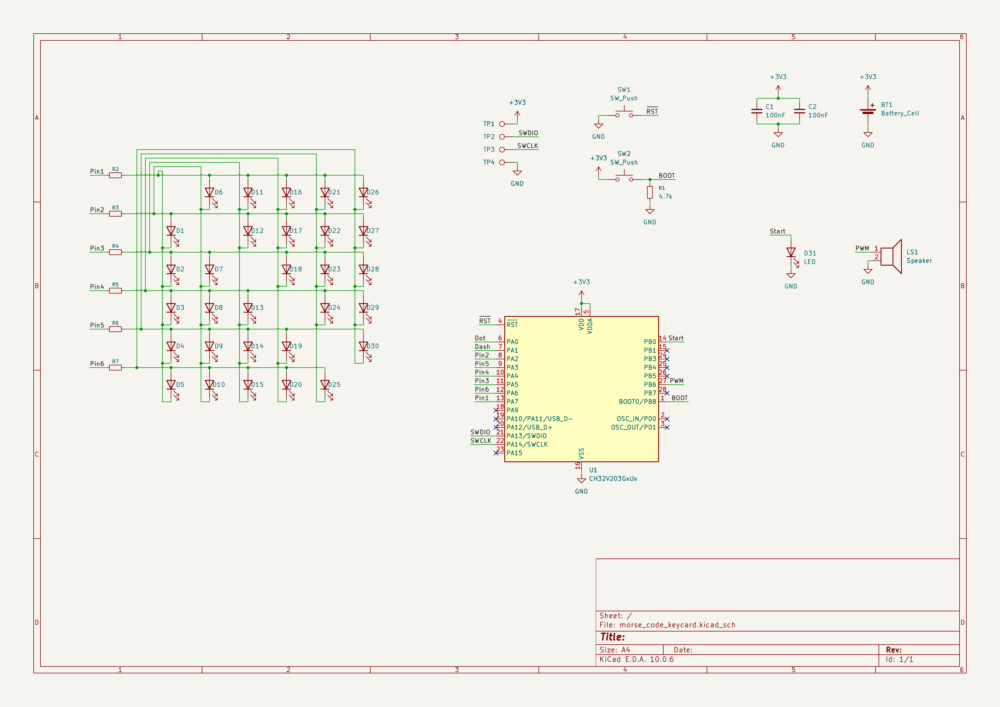
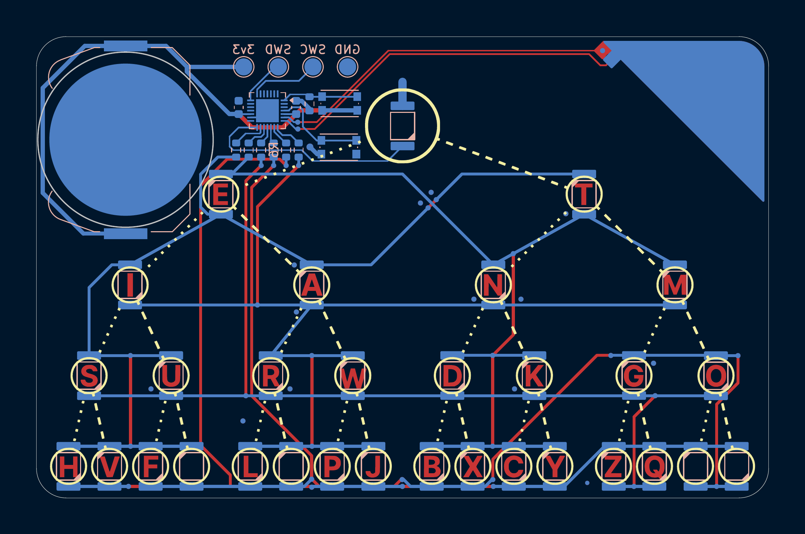
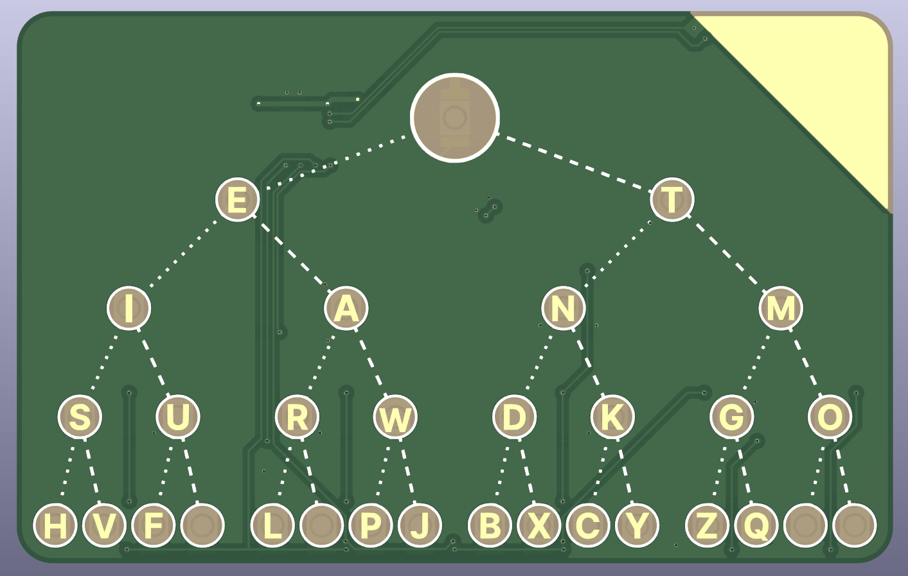
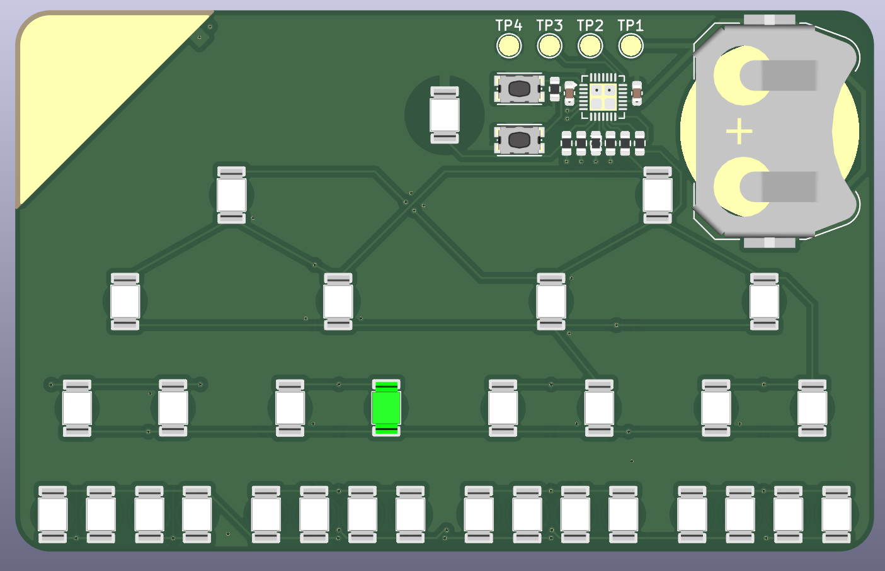

# morse-code-card
> A simple ch32 credit card sized morse code trainer

- CH32v203
- Dot/Dash pads with Touch Key peripheral
- Coincell powered
- Morse code tree
- Underglow LEDs with shine thru PCB

## BOM

| Part | Description | Price | Link |
|---|---|---|---|
| 100nF 0603 (CC0603KRX7R9BB104) | Capacitors | €0.0474 | [C14663](https://www.lcsc.com/product-detail/_C14663.html) |
| 4.7k 0603 (0603WAF4701T5E) | Resistors | €0.0052 | [C23162](https://www.lcsc.com/product-detail/_C23162.html) |
| 470Ω 0603 (0603WAF4700T5E) | Resistors | €0.0258 | [C23179](https://www.lcsc.com/product-detail/_C23179.html) |
| SW_Push (KMR221GLFS) | Switches | €2.7907 | [C72443](https://www.lcsc.com/product-detail/_C72443.html) |
| CH32V203G6U6 | Microcontroller | €1.2277 | [C5142280](https://www.lcsc.com/product-detail/_C5142280.html) |
| XZVG45WT-9 | LEDs | $10.00 | [C7129856](https://www.lcsc.com/product-detail/_C7129856.html) |
| BAT-HLD-001-TR SMD | Battery Holder | ~$0.47–0.58 | Could not find exact link | 
| **Total** |  | **€23.64, 27.46$** | | 

## Images

